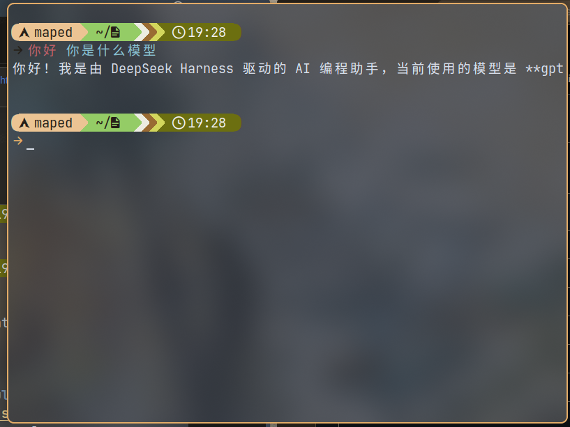
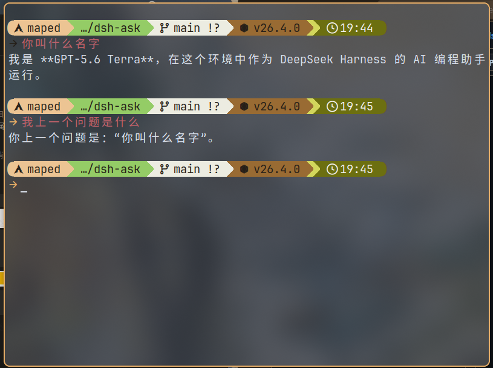

# dsh-ask

中文 | [English](README.md)

`dsh-ask` 是一个轻量的 [DeepSeek Harness](https://github.com/deepseek-ai/deepseek-harness) bundle：在当前目录提交一个问题，将可见回答流式输出到终端，然后退出；它不会启动 TUI。

## 行为

```sh
dsh --profile ask "这个函数做什么？"
```

默认会话由**绝对当前目录 + 当前父 shell**决定。同一终端、同一目录连续提问会恢复该终端的持久会话。即使目录相同，打开新终端也会得到一个新的默认会话。需要浏览或恢复旧会话时，请使用 Web 的会话界面。`--new` 为本次提问创建独立的持久会话；`--session <id>` 可指定一个持久会话。

每个 turn 结束前，runner 都会执行 `sessions.flush()`。因此 DSH 的 canonical event log 会在进程退出前落盘。使用默认 JSONL 后端时，文件位于 `$DSH_HOME/sessions/<编码后的 cwd>/<session-id>/session.jsonl.zstd`（通常是 `~/.dsh/sessions/...`）。记录包含用户消息、完整 assistant 消息、工具调用/结果及 turn 边界；dsh-ask 不会再维护一份可能与 DSH 不一致的历史副本。

## 终端输出

等待时，dsh-ask 在 stderr 显示 spinner 和真实生命周期状态，例如“正在准备持久会话”“正在思考”“正在调用工具”。模型发出的 `reasoning-delta` 会被归并为简短、持久的“思考”行，因此复杂问题在最终回答开始前也能显示有意义的进度；内容会合并空白并限制单行长度，不会按 token 逐个刷屏。

完成的 `tool/call` 会输出单独的“执行”行。它会显示工具名和最终参数中最有用的部分：shell 工具显示命令，文件工具显示路径，搜索工具显示模式和路径；不会把工具结果全文输出到终端。交互式终端中，思考行使用终端原生的灰色、淡化/斜体 SGR 样式，执行行使用醒目的粗体青色；不会新增或调整字体。stderr 被重定向时，两类内容都是不带 ANSI 样式的普通行（TTY 中设置 `NO_COLOR` 也会关闭颜色）。

可见 assistant `text-delta` 仍原样流式写入 stdout，首个可见 chunk 到达时会清除临时 spinner。如果可见文本开始后，后续步骤又继续思考或调用工具，其持久行会放在独立的 TTY 行中，不会被丢弃或写进未结束的回答行。活动信息始终走 stderr，因此 `dsh ... > answer.txt` 仍只会写入回答。如果某个 provider 不提供可见 chunk，则在 turn 结束后回退为一次性输出完整 assistant 消息。

### 样式预设

`outputStyle` 默认是 `auto`。单台机器可设置 `DSH_ASK_STYLE`；如需让一个 profile 持久使用某个预设，请在该 profile 后续的 `cordis.patch.yml` 覆盖 `ask-runner`：

```yaml
- id: ask-runner
  config:
    outputStyle: plain
```

| 预设 | 行为 |
| --- | --- |
| `auto` | 默认 TTY spinner；思考为灰色淡化/斜体，执行为粗体青色。 |
| `plain` | 仅输出普通行：不使用颜色、SGR、光标清除或 spinner 动画。适合旧终端、远程控制台和严格日志环境。 |
| `subtle` | 只使用标准的淡化/粗体强调，不使用颜色或斜体。 |
| `contrast` | 保留低调的思考样式，并用亮黄色突出执行操作。 |

`NO_COLOR` 仍可关闭带样式预设中的 SGR 颜色/字体样式；如果终端连控制序列都不兼容，请使用 `plain`。

## 命令

```sh
# 继续当前终端在此目录中的会话。
dsh --profile ask "继续实现"

# 仅为本次提问创建一个独立的持久会话。
dsh --profile ask --new "调查一个无关问题"

# 恢复或创建一个指定 id 的持久会话。
dsh --profile ask --session refactor-auth "继续重构"
```

`DSH_ASK_SESSION` 是可选环境变量，供包装脚本需要稳定、隔离的默认会话 id 时使用。

## Shell 集成

安装 bundle 时不会自动修改任何 shell 配置。每种 shell 都使用独立 init 命令，因此 Bash、Zsh、PowerShell 及其他 shell 都可以沿用同一模式。

每种集成都是 `src/templates/` 下的普通模板文件。执行 `pnpm run build` 时，这些文件会复制到 `lib/templates/`；已安装的二进制会在运行时读取包内模板，而不再将 shell 语法内嵌在 JavaScript 中。

### Fish

把 bundle 加入 `ask` profile 后，执行：

```sh
dsh plugin --profile ask exec dsh-ask init fish
source ~/.config/fish/conf.d/zz-dsh-ask.fish
```

新开启的 Fish 会自动加载生成的 `conf.d/zz-dsh-ask.fish`。它会截获未知的交互式命令，将其合并为问题，并执行：

```fish
command dsh --profile $DSH_ASK_PROFILE -- $text
```

下图展示未知 Fish 命令被转为提问后的回答，以及后续问题复用同一终端会话的过程。





`DSH_ASK_PROFILE` 默认是 `ask`；在启动 Fish 前设置它可使用其他 profile。生成的 wrapper 会保留原来的 `fish_command_not_found`，只在找不到 `dsh` 时回退。初始化程序不会覆盖一个不是它生成的同名文件。

### Bash

安装 Bash 片段后，在当前交互式 shell 中 source 它：

```bash
dsh plugin --profile ask exec dsh-ask init bash
source "${XDG_CONFIG_HOME:-$HOME/.config}/dsh-ask/bash-command-not-found.bash"
```

安装器不会修改 `~/.bashrc`。如需让以后开启的 shell 自动加载，请在 `~/.bashrc` 中、**发行版 command-not-found 初始化之后**手动加入同一条 `source` 命令。模板会保留已有的 `command_not_found_handle` 作为回退，拒绝包含换行符的输入，并且只对启动的子 `dsh` 进程设置 `DSH_SHELL=1`。

### Zsh

安装并 source Zsh 片段；请确保它位于框架或插件初始化之后：

```zsh
dsh plugin --profile ask exec dsh-ask init zsh
source "${XDG_CONFIG_HOME:-$HOME/.config}/dsh-ask/zsh-command-not-found.zsh"
```

安装器不会修改 `~/.zshrc`。如需持久启用，请在 `~/.zshrc` 中、Oh My Zsh、Prezto 或其他定义 `command_not_found_handler` 的插件之后加入同一条命令。模板会保留原 handler 作为回退，并对符合条件的未知交互式命令执行 `dsh --profile ${DSH_ASK_PROFILE:-ask}`。

### PowerShell（实验性）

在支持的交互式宿主中安装并 dot-source PowerShell 片段：

```powershell
dsh plugin --profile ask exec dsh-ask init powershell
. "$HOME/.config/dsh-ask/powershell-command-not-found.ps1"
```

如果设置了 `XDG_CONFIG_HOME`，或当前平台的 home 目录约定不同，请使用安装命令打印的准确路径。安装器不会修改 `$PROFILE`；如果需要持久启用，请自行将同一条 dot-source 命令加入 `$PROFILE`。

此集成依赖 `$ExecutionContext.InvokeCommand.CommandNotFoundAction`，会将已有 delegate 作为回退保留，并刻意标为实验性。Windows PowerShell、PowerShell 7、不同终端宿主和远程 runspace 的命令查找与交互行为均可能不同；持久启用前请在实际使用的每一种宿主中验证。

### 自定义或新增 Shell

开发 bundle 时，如需自定义集成，编辑 `src/templates/` 下对应的文件（例如 `fish.fish`、`bash.bash`、`zsh.zsh` 或 `powershell.ps1`）后执行 `pnpm run build`，再测试或打包。新增其他 shell 时，在该目录添加模板，并在 `src/bin/dsh-ask.ts` 的 `SHELL_INTEGRATIONS` 中添加对应条目。条目负责声明模板文件、生成文件标记、安装路径和激活命令；共用安装器会统一处理模板读取、覆盖保护和写入。

## TypeScript 开发

维护中的源代码位于 `src/`，`lib/` 是构建生成的 ESM JavaScript、类型声明和 source map，不能手工修改。修改 link 到 profile 的包或打包发布前，请先构建：

```sh
pnpm install
pnpm run typecheck
pnpm run build
```

Cordis 和 DSH 包保持为 peer dependencies，因此 profile 会为 bundle 提供同一组服务实例。关于源码/构建产物布局及验证命令，请见 [TypeScript 维护说明](docs/typescript-comparison.md)。

## 开发与发布

当前 checkout 使用本地占位包名 `@dsh-local/dsh-ask`，并保持 `private: true`，避免误发布到并不属于你的 npm scope。公开发布前，请把 `name` 改成你拥有的 scope，并把 `private` 改为 `false`。DSH 运行时包是 peer dependencies，因此 bundle 与 profile 共享 Cordis 和 DSH 服务实例，不会加载重复实例。

公开 bundle 的安装方式与其他 DSH bundle 一致，例如：

```sh
dsh plugin --profile ask add <你的包名或 git spec>
dsh plugin --profile ask exec dsh-ask init fish
```
